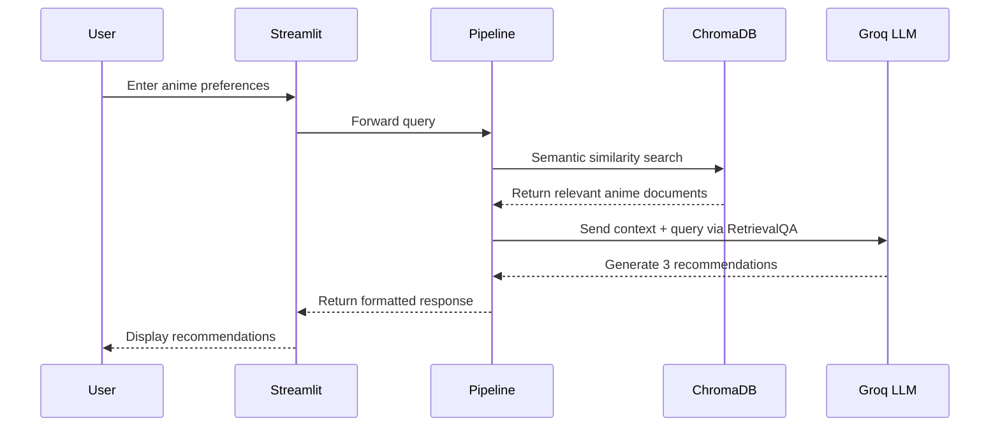

<div align="center">

# 🎌 AI Anime Recommender

### An end-to-end, production-grade AI-powered anime recommendation system

[](https://python.org)
[](https://langchain.com)
[](https://groq.com)
[](https://www.trychroma.com)
[](https://streamlit.io)
[](https://docker.com)
[](https://kubernetes.io)
[](https://cloud.google.com)
[](https://grafana.com)

**Not just a RAG demo — a full LLMOps pipeline, containerized, deployed on GCP, and monitored in real time.**

[Features](#-features) · [Architecture](#-architecture) · [Tech Stack](#%EF%B8%8F-tech-stack) · [Getting Started](#-getting-started) · [Deployment](#-deployment) · [Project Structure](#-project-structure)

</div>

---

## ✨ Features

- 🔍 **Semantic Search** — Finds contextually relevant anime using vector similarity, not just keyword matching
- 🤖 **LLM-Powered Recommendations** — Generates rich, personalized suggestions with plot summaries and reasoning via Groq's Llama 3.1
- ⚡ **Lightning-Fast Inference** — Powered by Groq API for near-instant response times
- 🎯 **Custom Prompt Engineering** — Structured prompt templates ensure consistent, high-quality recommendations
- 🐳 **Production-Ready** — Fully Dockerized with Kubernetes deployment on GCP
- 📊 **Real-Time Monitoring** — Integrated Grafana Cloud observability for live usage tracking
- 🛡️ **Robust Error Handling** — Custom exception handling and structured logging throughout the entire pipeline

---

## 🏗️ Architecture

<div align="center">


</div>

The system follows a modular, three-stage architecture:

### 1. Project Setup
Environment configuration with API keys (Groq, HuggingFace), virtual environment isolation, structured logging, and custom exception handling — establishing a solid foundation before any code execution.

### 2. Core Code Pipeline
```
Configuration → Data Loader → ChromaDB → Prompt Templates → Recommender Class → Train & Recommend
```
- **Configuration** — Centralized environment variable management via `dotenv`
- **Data Loader** — Ingests raw anime CSV data, validates required columns (`Name`, `Genres`, `synopsis`), and generates combined text representations
- **Vector Store (ChromaDB)** — Splits processed documents into chunks, generates embeddings using `all-MiniLM-L6-v2`, and persists them for semantic retrieval
- **Prompt Templates** — Custom LangChain `PromptTemplate` that instructs the LLM to return exactly 3 recommendations with titles, summaries, and match explanations
- **Recommender** — LangChain `RetrievalQA` chain connecting the ChromaDB retriever with the Groq LLM
- **Pipeline Orchestration** — Separate build and inference pipelines for clean separation of concerns

### 3. Deployment & Monitoring
Containerized via Docker, orchestrated with Kubernetes on a GCP VM, version-controlled through GitHub, and monitored end-to-end with Grafana Cloud (Prometheus metrics + Loki logs).

---

## ⚙️ Tech Stack

| Layer | Technology | Purpose |
|---|---|---|
| **LLM** | Groq API (Llama 3.1-8B-Instant) | Lightning-fast inference for generating recommendations |
| **Embeddings** | HuggingFace (`all-MiniLM-L6-v2`) | Sentence-level semantic embeddings |
| **Vector Store** | ChromaDB | Persistent vector storage and similarity search |
| **Orchestration** | LangChain (`RetrievalQA`) | RAG pipeline chaining retriever + LLM with custom prompts |
| **Frontend** | Streamlit | Clean, interactive web UI for user queries |
| **Containerization** | Docker | Production-grade container with Python 3.10-slim base |
| **Orchestration** | Kubernetes (K8s) | Deployment, scaling, and service management on GCP |
| **Cloud** | Google Cloud Platform (VM) | Production hosting environment |
| **Monitoring** | Grafana Cloud | Real-time observability (Prometheus metrics + Loki logs) |
| **Secrets** | python-dotenv | Environment-isolated secrets management |

---

## 📂 Project Structure

```
AI-Anime-Recommender/
│
├── app/
│   ├── __init__.py
│   └── app.py                    # Streamlit frontend application
│
├── config/
│   ├── __init__.py
│   └── config.py                 # Centralized configuration & environment variables
│
├── src/
│   ├── __init__.py
│   ├── data_loader.py            # CSV data ingestion & preprocessing
│   ├── vector_store.py           # ChromaDB vector store builder & loader
│   ├── prompt_template.py        # Custom LangChain prompt template
│   └── recommender.py            # RetrievalQA chain for anime recommendations
│
├── pipeline/
│   ├── __init__.py
│   ├── build_pipeline.py         # One-time vector store initialization pipeline
│   └── pipeline.py               # Runtime recommendation pipeline
│
├── utils/
│   ├── __init__.py
│   ├── logger.py                 # Structured logging configuration
│   └── custom_exception.py       # Custom exception with file/line tracking
│
├── data/
│   ├── anime_with_synopsis.csv   # Raw anime dataset with synopses
│   └── anime_updated.csv         # Processed dataset with combined info
│
├── chroma_db/                    # Persisted ChromaDB vector store
├── logs/                         # Application log files (daily rotation)
├── images/                       # Architecture diagrams & assets
│
├── Dockerfile                    # Production Docker configuration
├── llmops-k8s.yaml               # Kubernetes Deployment & Service manifest
├── helm_chart.txt                # Grafana Cloud Helm chart configuration
├── setup.py                      # Python package setup
├── requirements.txt              # Python dependencies
├── .env                          # Environment variables (not tracked)
├── .dockerignore                 # Docker build exclusions
└── .gitignore                    # Git exclusions
```

---

## 🚀 Getting Started

### Prerequisites

- Python 3.10+
- [Groq API Key](https://console.groq.com/) (free tier available)
- [HuggingFace API Key](https://huggingface.co/settings/tokens)

### 1. Clone the Repository

```bash
git clone https://github.com/Anand-Velpuri/AI-Anime-Recommender.git
cd AI-Anime-Recommender
```

### 2. Set Up Virtual Environment

```bash
python -m venv venv
source venv/bin/activate        # macOS / Linux
# venv\Scripts\activate         # Windows
```

### 3. Install Dependencies

```bash
pip install -e .
```

This installs the project as an editable package along with all dependencies from `requirements.txt`.

### 4. Configure Environment Variables

Create a `.env` file in the project root:

```env
GROQ_API_KEY=your_groq_api_key_here
HUGGINGFACE_API_KEY=your_huggingface_api_key_here
```

### 5. Build the Vector Store

Run the build pipeline to process the anime dataset and create the ChromaDB vector store:

```bash
python pipeline/build_pipeline.py
```

> **Note:** This is a one-time setup step. The vector store is persisted in `chroma_db/` and reused across application restarts.

### 6. Run the Application

```bash
streamlit run app/app.py
```

The app will be available at `http://localhost:8501`

---

## 🐳 Deployment

### Docker

Build and run the container locally:

```bash
# Build the Docker image
docker build -t llmops-app .

# Run the container
docker run -p 8501:8501 --env-file .env llmops-app
```

### Kubernetes (GCP)

Deploy to a GCP VM with Kubernetes:

```bash
# Create secrets from environment variables
kubectl create secret generic llmops-secrets \
  --from-literal=GROQ_API_KEY=your_key \
  --from-literal=HUGGINGFACE_API_KEY=your_key

# Apply the Kubernetes manifest
kubectl apply -f llmops-k8s.yaml

# Verify the deployment
kubectl get pods
kubectl get services
```

The K8s manifest (`llmops-k8s.yaml`) configures:
- A **Deployment** with the containerized app
- A **LoadBalancer Service** exposing port 80 → 8501

### Grafana Cloud Monitoring

The project includes a pre-configured Helm chart (`helm_chart.txt`) for Grafana Cloud integration:

- **Prometheus** — Cluster & host metrics collection
- **Loki** — Pod log aggregation
- **OpenCost** — Cost monitoring
- **Kepler** — Energy metrics
- **Fleet Management** — Remote configuration

---

## 🔧 How It Works



1. **User Input** — The user describes their anime preferences (e.g., *"light-hearted anime with a school setting"*)
2. **Semantic Retrieval** — ChromaDB finds the most relevant anime entries using vector similarity on HuggingFace embeddings
3. **LLM Generation** — The retrieved context is passed to Groq's Llama 3.1 via a custom prompt template through LangChain's `RetrievalQA` chain
4. **Structured Output** — The LLM returns exactly 3 recommendations, each with a title, plot summary, and explanation of why it matches

---

## 🛡️ Engineering Practices

- **Modular Architecture** — Clean separation across `config`, `src`, `pipeline`, `utils`, and `app` packages
- **Custom Exception Handling** — `CustomException` class captures file name and line number for precise error tracing
- **Structured Logging** — Daily rotating log files with timestamped entries for production debugging
- **Separate Build Pipeline** — Vector store initialization is decoupled from the runtime inference pipeline
- **Environment Isolation** — All secrets managed via `dotenv`, never hardcoded
- **Docker Best Practices** — Slim base image, `.dockerignore` for minimal build context, non-cached pip installs
- **Package Structure** — Installable as a Python package via `setup.py` with proper `__init__.py` modules

---

## 📄 License

This project is open source and available under the [MIT License](LICENSE).

---

## 🤝 Contributing

Contributions, issues, and feature requests are welcome! Feel free to check the [issues page](https://github.com/Anand-Velpuri/AI-Anime-Recommender/issues).

---

<div align="center">

**Built with ❤️ by [Anand Velpuri](https://github.com/Anand-Velpuri)**

If you found this project helpful, please consider giving it a ⭐

</div>
